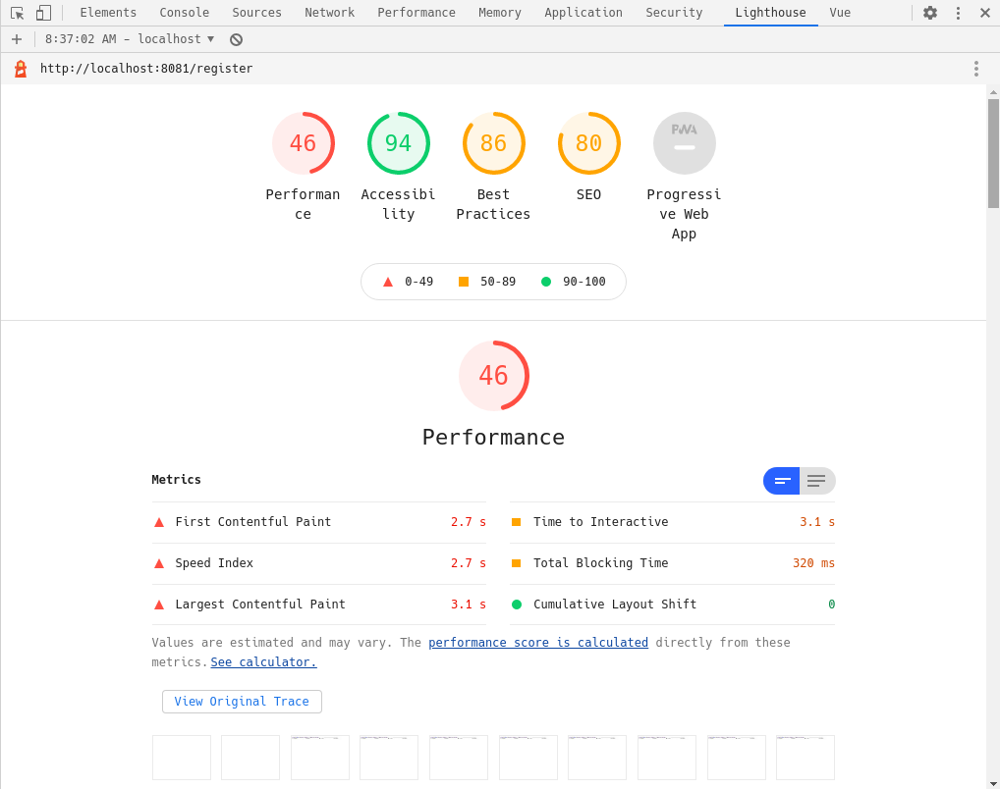
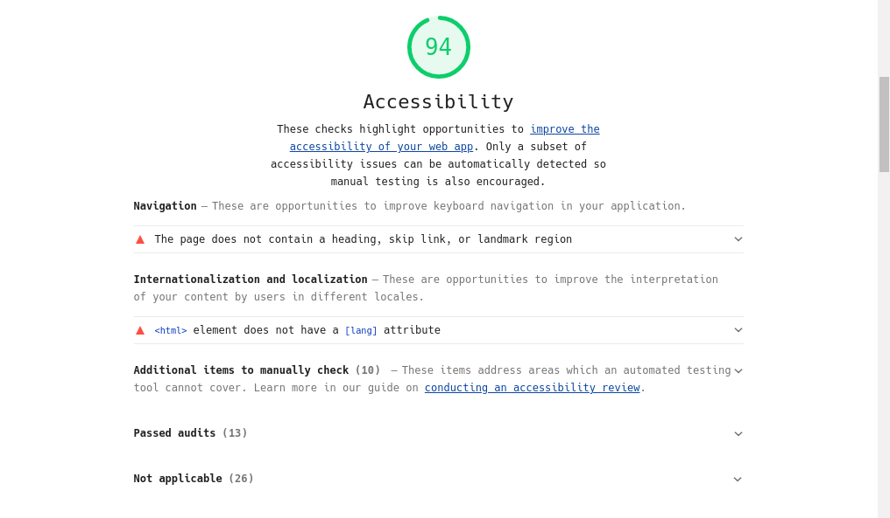
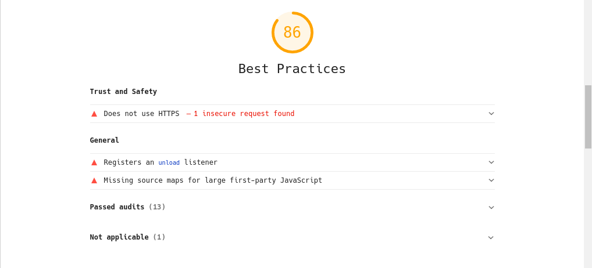

# itmo-software-testing-2020
2020 Software Testing Course at ITMO University.

## Home work checklist

### Занятие 1. Основы теории.

### Занятие 2. Тестирование Frontend.

Main часть:

- [x] Создать репозиторий на GitHub, в котором создать папку `client`.
- [x] В папке `client` создать приложение на React / Angular / Vue фреймворке на ваш выбор. У кого будет выбран самый редкий фреймворк -- получат дополнительные баллы.
- [x] Требования к приложению: должно содержать несколько страниц с роутингом, обязательно содержать сервис, который общается с node.js бекендом.
- [x] Присутствуют unit, component и e2e тесты в минимальном количестве 1шт каждый.

Advanced часть:

- [x] Приложение содержит авторизацию и не собрано из генераторов вида JHipster.
- [x] Написаны тесты для проверки авторизации.
- [x] Существует нескольно наборов тестов (несколько suites).

Bonus часть:

- [x] Вы рассматриваете два любых фреймворка на выбор. Например: Mocha и Jest или Playwright и Cypress.
- [x] Пишете примеры с каждым из фреймовокров для своего приложения.
- [x] Короткая статья или заметки в чем именно для вас кажутся основные отличия.
- [ ] Делаете в своем репозитории на GitHub активным GitHub pages и размещаете эту статью там.

### Занятие 3. Тестирование Frontend: e2e тестирование.

Main часть:

- [x] В первой части домашнего задания у вас уже есть приложение с юнит и компонентными тестами. Самое время дополнить его e2e тестами.
- [x] Необходимо написать не менее 5 тестов на каждом из фреймворков: Cypress и Playwright.

Advanced часть:

- [ ] Разобраться как с помощью Cypress и Playwright делать авторизацию в вашем приложении, чтобы каждый тест не проходил форму логина(авторизации).

Bonus часть:

- [ ] Написать e2e тесты, которые делают скриншот тестирование и запись видео. Найти дефекты, которые будут обнаружены с помощью видео или скриншот теста, но при этом найти их с помощью юнит или компонентных тестов не тривиально. 
- [ ] По результатам написать статью в ваш блог(блог на github pages, который вы делали в 1 дз).

### Занятие 4. Тестирование Backend. Введение. 

### Занятие 5. Тестирование Backend. Unit testing. Component testing.

Main часть:

- [X] Сделать сервис на Java+Spring+любая DB, который имеет как мин 1 Controller.
- [x] Написать Unit и Component тесты для этого сервиса. Использовать TestContainers для одного теста с DB. Использовать Mockito для мокирования тестов с внешним сервисом.
- [x] Написать документацию(README) какие тесты еще необходимо написать, но вы не успели.

Advanced часть:

- [x] Сделать взаимодействие сервиса и вашего Frontend приложения.
- [x] Сделать тесты на авторизацию.
- [ ] Создать отдельные Spring Test Configruation, которые можно переключать с помощью флага при запуске тестов.
- [ ] Сделать генерацию тестовой документации через Asci Doctor(Spring Rest Docs).

Bonus часть:

- [ ] Придумать функциональность, с которой можно использовать очереди/стримы вида RabbitMQ/Kafka streams. Написать компонентные тесты на эту функциональность(используя TestContainers).

### Занятие 6. CI/CD. GitHub actions. Azure.

Main часть:

- [x] Добавить GitHub action для запуска тестов на UI и Backend по пушу из в master ветку.

Advanced часть:

- [ ] Добавить GitHub action для деплоя приложения UI+BE на Azure/Vercel/Яндекс Облако.

Bonus часть:

- [ ] Использовать Kubernetes в Azure/Яндекс Облаке для разворачивания среды.

### Занятие 7. Reporting. BDD.

Bonus часть:

- [x] Использовать Allure reporting для написанных тестов.

### Занятие 8. Contract tests. Pact. Spring cloud contract.

Bonus часть:

- [ ] Написать Pact-тесты к своему сервису.

### Занятие 9. A11Y. Instruments.

Bonus часть:

- [ ] Протестировать свой веб-сайт на а11y с помощью инструментов от Mozilla и Lighthouse.
- [ ] Пофиксить проблемы.
- [ ] Сделать автоматический тест с axe.

### Занятие 10. Selenium. Selenide. Selenoid.

Main часть:

- [x] Написать e2e тесты, используя Selenide.

Advanced часть:

- [ ] Настроить запуск тестов с Selenoid.

Bonus часть:

- [ ] Настроить генерацию отчетов с Allure report, сделав полный сетап в GitHub: e2e тесты с Selenide запускаются с использованием Selenoid на разных окружениях(браузерах) параллельно и собирают отчет с помощью Allure Report.
- [ ] Написать статью как собрать такой сетап.

### Занятие 11. Performance testing.

Main часть:

- [ ] Пройти воркшоп и выложить результат в гитхаб репозиторий.

Advanced часть:

- [ ] Настроить CI с GitHub actions.

Bonus часть:

- [ ] Настроить генерацию отчетов с Allure report.

## Cypress vs Playwright vs Selenide

### Cypress

#### Плюсы

- Хороший UI, понятное апи. Самый наглядный из трёх, даёт очень хорошее описание тестов.
- По ощущениям ставится легче остальных, возможно потому что его можно выбрать при генерации проекта на Vue.

#### Минусы

Минусами особо не выделился, больше похож на Selenide, но не такой объёмный.

### Playwright

#### Плюсы

- Простой в плане апи (в плане количества и сложности сущностей). Можно спокойно просмотреть большую часть документации достаточно быстро.
- Очень просто запустить одни и те же тесты на разных платформах.

#### Минусы

- Мало гайдов и примеров по сравнению с остальными.
- Гораздо менее наглядный по сравнению с остальными: не показывает что делает. Возможно это я не нашёл как это включить, но остальные по дефолту открывают "браузер" и показывают что происходит. Очень помешало пока я искал что после нажатия на кнопку надо подождать (вызвать метод) перехода на другую страницу.
- Менее понятный синтаксис и некоторые неочевидные места (см. прошлый минус), не позволяет более-менее угадывать что надо писать без подробного изучения документации. 

### Selenide

#### Плюсы

- Очень удобный и понятный, ничего лишнего в апи. По этим параметрам явно опережает остальные.
- Из коробки (проект через плагин для IDEA) ставится с Allure report.

#### Минусы

- Вероятно самый ресурсоёмкий из трёх.
- Очень объёмный по возможностям, а значит и по затратам на изучение и настройку (при необходимости дополнительных возможностей вроде GUI). Однако, как и в остальных, для простых тестов хватает маленького подмножества апи.
- Слишком много похожих названий: Selenium, Selenide, Selenoid. Очень путает, хотя и понятно что так произошло из-за их тесной связи.

# A11y report from Lighthouse.

