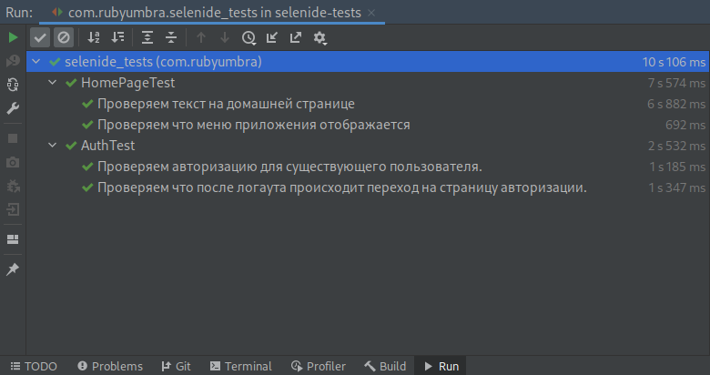
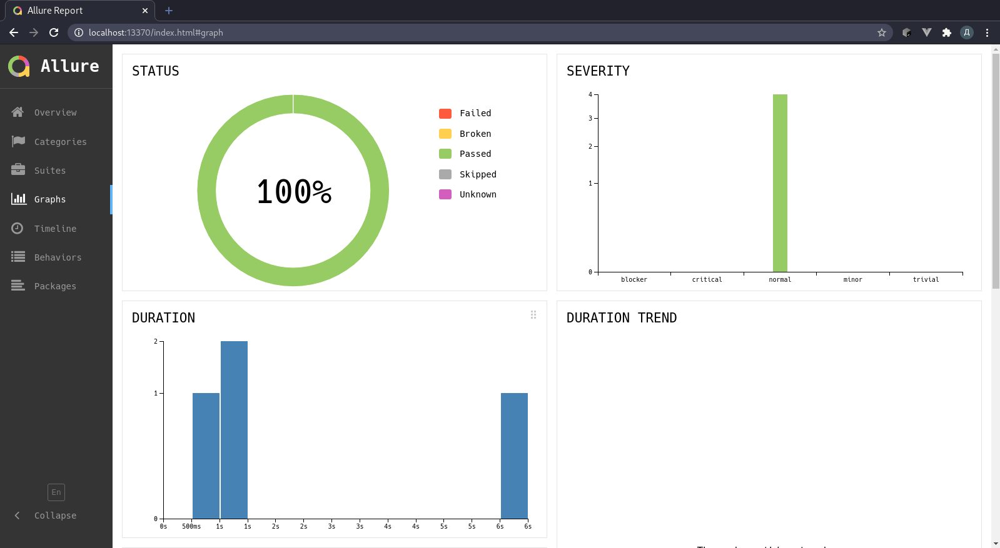

Allure reports doesn't work good on my i3wm...

```
ruby@gds /h/g/i/s/allure-results (main)> allure serve .
Generating report to temp directory...
Report successfully generated to /tmp/4014659635452918169/allure-report
Starting web server...
2021-01-30 02:44:41.136:INFO::main: Logging initialized @3142ms to org.eclipse.jetty.util.log.StdErrLog
Exception in thread "main" java.lang.UnsupportedOperationException: The BROWSE action is not supported on the current platform!
	at java.desktop/java.awt.Desktop.checkActionSupport(Desktop.java:380)
	at java.desktop/java.awt.Desktop.browse(Desktop.java:524)
	at io.qameta.allure.Commands.openBrowser(Commands.java:213)
	at io.qameta.allure.Commands.open(Commands.java:138)
	at io.qameta.allure.Commands.serve(Commands.java:122)
	at io.qameta.allure.CommandLine.run(CommandLine.java:144)
	at java.base/java.util.Optional.orElseGet(Optional.java:362)
	at io.qameta.allure.CommandLine.main(CommandLine.java:73)
```

Problem caused by browser opening so I can execute:

```
allure serve --port=13370 .
```

And open `http://localhost:13370`.


Execute Selenide e2e tests:



Check allure report:


